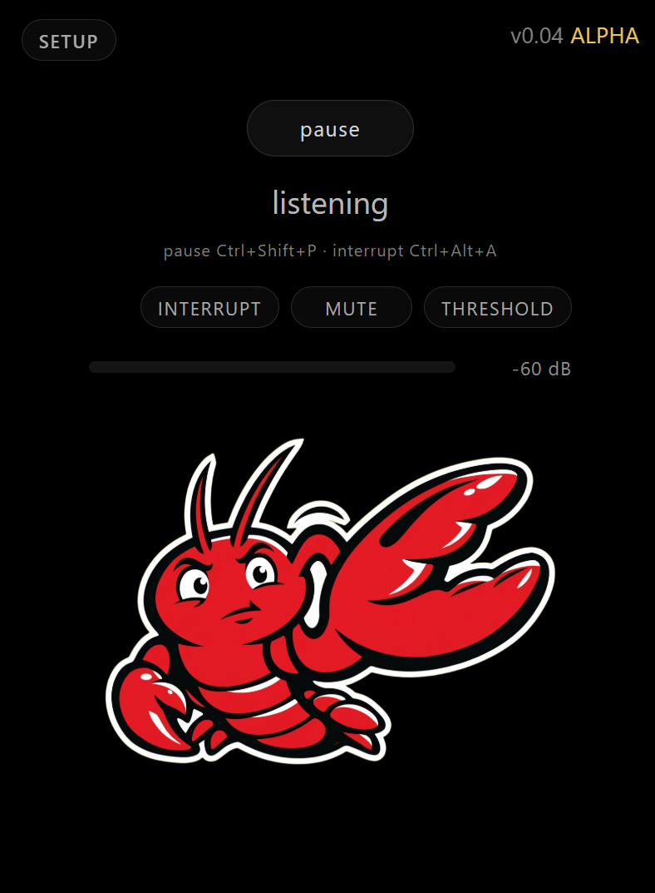

# OpenClaw Voice Server



`openclaw-voice-server` is an alpha browser voice client for an existing OpenClaw gateway session.

It is provided as-is. It works well in the tested path, but it can still break, regress, or have rough edges.

## What It Does

- serves a browser setup flow at `/setup`
- serves a minimal voice runtime at `/voice`
- records mic audio in the browser
- detects end-of-utterance in the browser
- sends speech to the Python server for transcription
- sends the transcript to an OpenClaw gateway chat-completions endpoint
- synthesizes the reply with Edge TTS or ElevenLabs
- streams reply audio back to the browser

## How It Works

High level flow:

1. The browser captures microphone input.
2. The browser decides when the user finished speaking.
3. The Python server transcribes the audio with a Whisper-family backend.
4. The server sends the transcript to OpenClaw through the local gateway.
5. The server synthesizes the model reply with the selected TTS provider.
6. The browser plays the streamed reply audio and returns to listening.

## Alpha Status

- this is alpha software
- it is meant for real-world testing, not polished distribution
- gateway restarts, shared-session edge cases, and UI gaps can still cause failures
- if you need a stable production-grade voice client, this is not there yet

## Requirements

- Python 3.11+
- an existing OpenClaw installation
- an OpenClaw gateway reachable locally from the same host, typically `http://127.0.0.1:18789`
- one working STT backend
- one working TTS backend
- a supported voice client surface
- Tailscale if you want to use the app from other devices over MagicDNS

Optional, depending on chosen providers:

- CUDA if using GPU STT
- ElevenLabs API key if using ElevenLabs
- Edge TTS package if using Edge TTS

Supported access paths right now:

- `http://127.0.0.1:8765` on the host itself
- the Windows Tauri client in [clients/windows](clients/windows)
- `https://<machine>.ts.net/voice/` only for browser paths that actually work in your environment

Current platform limitation:

- the tested remote path is the existing Windows setup
- iOS and macOS browser clients should currently be treated as unsupported
- Safari/WebKit behavior is not a working target right now

Network model:

- `127.0.0.1` is local to the machine running the service
- the voice server itself runs locally on that machine
- the browser can still reach it from other devices when your existing OpenClaw/Tailscale setup proxies `/voice/`
- the voice server talks to the OpenClaw gateway locally on the same host
- Tailscale/MagicDNS is for browser access from other devices, not for the voice server's backend-to-backend gateway call
- remote browser reachability does not imply the voice runtime will work correctly on iOS/macOS

## Tests

Run tests with:

```bash
PYTHONPATH=src python3 -m pytest
```

## Install

The backend and the Windows client are separate components. Install and run them separately.

### Backend

Use this on Linux, macOS, or WSL.

```bash
git clone <repo-url>
cd openclaw-voice-server
python3 -m venv .venv
source .venv/bin/activate
python -m pip install --upgrade pip
pip install -e .[dev]
cp .env.example .env
```

Edit `.env` and set at least:

```dotenv
OPENCLAW_VOICE_GATEWAY_TOKEN=your-openclaw-gateway-token
```

Add `OPENCLAW_VOICE_ELEVENLABS_API_KEY=...` only if you plan to use ElevenLabs.

Important runtime detail:

- start `openclaw-voice-server` from the repo root unless you also set `OPENCLAW_VOICE_CONFIG_FILE` and `OPENCLAW_VOICE_ENV_FILE`
- by default the server reads `config.json` and `.env` from the current working directory

Optional extras, depending on the providers you actually want to use:

```bash
pip install -e .[dev,stt-faster-whisper,stt-whisper,tts-edge]
```

Run the backend:

```bash
cd /path/to/openclaw-voice-server
source .venv/bin/activate
openclaw-voice-server
```

Health check:

```bash
curl http://127.0.0.1:8765/health
```

Finish setup in the browser:

1. Open `http://127.0.0.1:8765/setup`.
2. Validate one STT backend.
3. Validate one TTS provider and voice.
4. Validate the OpenClaw gateway URL, model, session key, and token.
5. Open `http://127.0.0.1:8765/voice`.

Voice control tuning:

- use the `threshold` control in the voice UI to dial in end-of-turn detection and barge-in behavior
- there is no separate command-calibration workflow in this repo

### Windows Client

Use this only if you want the Windows tray/Tauri wrapper. It does not replace the Python backend.

Prerequisites:

- Windows with WebView2
- Node.js 20+
- Rust installed through `rustup`
- the Python backend above already running on `http://127.0.0.1:8765`

Install and run the client from Windows:

```powershell
cd C:\path\to\openclaw-voice-server\clients\windows
npm install
npm run tauri:dev
```

Build a Windows bundle:

```powershell
cd C:\path\to\openclaw-voice-server\clients\windows
npm install
npm run tauri:build
```

Startup order:

1. Start the Python backend.
2. Start the Windows client.
3. Use the tray app or the window at `http://127.0.0.1:8765/voice`.

For tray behavior, shortcuts, and Windows-specific verification notes, see [clients/windows/README.md](clients/windows/README.md).

Default local bind:

```text
http://127.0.0.1:8765
```

Recommended Tailscale/MagicDNS address when routed through the existing OpenClaw gateway:

```text
https://<machine>.ts.net/voice/
```

Treat that as a remote access URL, not as a promise that every browser engine works. The current tested path is still Windows-first.

## Configuration

Configuration is split across:

- `config.json` for normal settings
- `.env` for secrets

The setup UI validates each section before saving it.

Setup sections:

1. `STT`
   Pick the speech-to-text backend, language, device, and model.
2. `TTS`
   Pick the speech provider.
3. `Edge Voice`
   If Edge is selected, choose and validate the voice.
4. `ElevenLabs`
   If ElevenLabs is selected, validate the API key and voice.
5. `Conversation Backend`
   Point the app at the local OpenClaw gateway and validate the session/model/token.

Important gateway rule:

- use the local gateway URL, for example `http://127.0.0.1:18789`
- the app will normalize it to `/v1/chat/completions`
- do not use the public `.ts.net` URL in the gateway field
- the `.ts.net` URL is for opening the voice UI from another device in a browser

## Sessions

By default, the app is intended to use a dedicated voice-chat session key.

That default can be overridden with another existing session key, including one that also routes messages to a channel such as Telegram.

That gives you two useful modes:

- dedicated voice session
  voice chat stays isolated from other channels
- shared channel-linked session
  for example, if voice uses the same session as Telegram:
  the agent can speak with you in voice chat and also send messages into Telegram
  and if you write to the agent in Telegram, that context can later be recalled inside the voice chat

This shared-session mode is powerful, but it also means voice and the other channel are using the same OpenClaw session state.

## Known Bugs

- minor: unnecessary OpenAI/OpenAI-compat sessions may still be spawned in some flows
- spoken voice command detection still needs more real-world tuning
- Windows tray shell is usable, but still has rough edges and should be treated as alpha
- iOS/macOS browser use should currently be treated as unsupported; do not assume Safari/WebKit will behave like the tested Windows path

## Tested

Tested successfully in the main path:

- Faster Whisper on CUDA
- ElevenLabs TTS
- OpenClaw local gateway on `127.0.0.1:18789`
- proxied `/voice/` route behind the existing OpenClaw/Tailscale setup
- Windows Tauri tray shell with a local WSL backend

## Not Yet Tested

- Edge TTS
- OpenAI Whisper on CPU

## Not Supported Right Now

- iPhone/iOS browser use
- macOS browser use
- assuming Safari/WebKit behaves like the tested Windows browser/Tauri path

## TODO

- test Edge TTS end to end
- test Whisper on CPU end to end
- keep tuning spoken command detection for `hey stop` and `hey pause`
- move desktop shortcut bindings into configuration instead of hardcoded defaults

## Routes

- `GET /` serves `/setup` until runtime config is valid, then serves `/voice`
- `GET /setup` setup flow
- `GET /voice` voice runtime
- `GET /health` liveness/readiness
- `GET /api/setup/state` setup state
- `GET /api/runtime/state` runtime browser settings
- `POST /api/runtime/interrupt-probe` short STT probe for spoken control detection
- `POST /api/runtime/speak` synthesize arbitrary text and push it to the active voice client
- `GET /ws/voice` voice websocket

Example:

```bash
curl -X POST http://127.0.0.1:8765/api/runtime/speak \
  -H 'content-type: application/json' \
  -d '{"text":"[voice:expressive]Hello from OpenClaw voice."}'
```

Notes:

- this only works while a `/voice` browser tab or Windows shell is actively connected
- the injected speech is serialized with normal voice turns, so it will wait for any in-flight reply to finish
