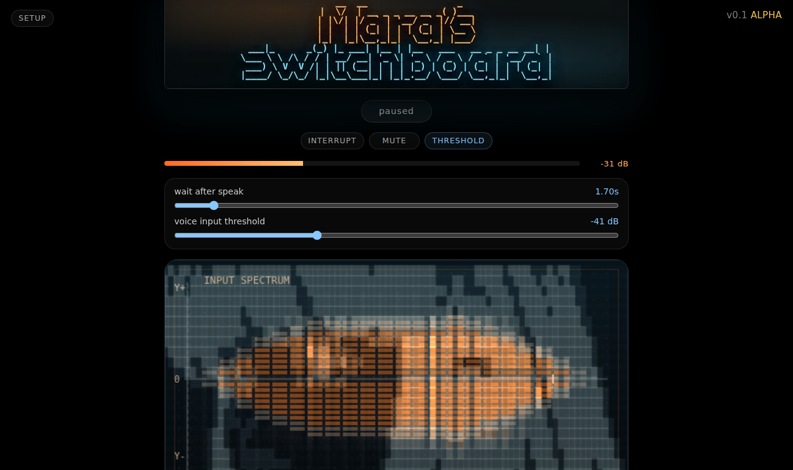

# Mara's Switchboard



`maras-switchboard` is a local voice frontend for text agents. It gives you a browser setup page at `/setup`, a voice UI at `/voice`, local or remote STT, multiple TTS backends, and an optional Windows tray client.

Current version: `0.1`. This repo is still alpha. The main path works, but rough edges still exist.

## What This Repo Does

- records mic audio in the browser
- sends speech to the Python server for transcription
- sends the transcript to your configured conversation backend
- optionally speaks the reply with TTS
- can run in text-only mode with TTS disabled
- exposes a setup page so you can validate each step before launch

## Before You Start

You need all of these before the app can work:

- `git`
- Python `3.11+`
- one working conversation backend
- one working STT backend
- optionally one TTS backend

The currently tested path is:

- backend on Linux, macOS, or WSL
- browser UI at `http://127.0.0.1:8765`
- optional Windows tray client from `clients/windows`

Treat iOS, macOS Safari, and random remote mobile browser paths as unsupported unless you personally verify them.

Install missing base tools:

```bash
# Debian/Ubuntu/WSL
sudo apt update
sudo apt install -y git python3 python3-venv python3-pip
```

```powershell
# Windows, for the optional tray client
winget install Git.Git OpenJS.NodeJS.LTS Rustlang.Rustup Microsoft.EdgeWebView2Runtime
```

## Fast Start

If you want the shortest route to a first working run, do this.

1. Clone the repo.

```bash
git clone https://github.com/zoidypuh/maras-switchboard.git maras-switchboard
cd maras-switchboard
```

2. Create and activate a virtual environment.

```bash
python3 -m venv .venv
source .venv/bin/activate
```

3. Install the app.

```bash
python -m pip install --upgrade pip
pip install -e .[dev]
```

4. Create your local env file.

```bash
cp .env.example .env
```

5. Edit `.env`.

At minimum, if you use the gateway backend, set:

```dotenv
MARAS_SWITCHBOARD_GATEWAY_TOKEN=replace-me
```

If you use ElevenLabs, also set:

```dotenv
MARAS_SWITCHBOARD_ELEVENLABS_API_KEY=replace-me
```

If you use xAI STT, set:

```dotenv
XAI_API_KEY=replace-me
```

If you use Chatterbox Turbo TTS, point the setup page at a Python environment that already has `chatterbox-tts` installed and at a clear reference audio prompt longer than five seconds:

```dotenv
MARAS_SWITCHBOARD_CHATTERBOX_TURBO_PYTHON_PATH=/home/gismar/coding/chatterbox-tts/.venv/bin/python
MARAS_SWITCHBOARD_CHATTERBOX_TURBO_VOICE_PROMPT_PATH=/path/to/reference-audio.wav
```

6. Start the server from the repo root.

```bash
source .venv/bin/activate
maras-switchboard
```

7. Open the setup page in a browser.

```text
http://127.0.0.1:8765/setup
```

8. In the setup page, do these steps in order:

- validate one STT backend
- validate one TTS backend, or choose `Disabled (text only)` for the simplest first run
- validate the conversation backend
- open the voice app

9. Open the voice UI.

```text
http://127.0.0.1:8765/voice
```

If setup is complete, `http://127.0.0.1:8765/` will also open the voice UI.

## Easiest First Run

If you only want to prove the pipeline works and do not care about spoken replies yet:

- set up STT
- choose `Disabled (text only)` in the TTS section
- validate the conversation backend
- open `/voice`

That removes TTS from the first-run debugging path.

## Voice UI Notes

- Browser and Windows client windows use the title `Mara's Switchboard`.
- The voice UI starts with a shaded ASCII `Mara's` over `Switchboard` title.
- The voice UI starts muted. Click `mute` to unmute for normal freehand conversation; click it again to mute.
- The only global keyboard shortcut is `Ctrl+Alt+Shift+A`: hold it to record, release it to send the captured speech, then the client returns to mute.
- The shortcut is shown above the ASCII title in small text.
- The `interrupt` button toggles between inactive and `barge in`. There is no separate interrupt mode panel.
- The `mute` button keeps the same label and uses its active state to show whether mute is enabled.
- The sliders button opens the two live tuning controls: voice threshold and wait-after-speak.
- The state display uses a lower-resolution pixel spectrum renderer with cached ASCII backdrop art so it costs less per frame than the older high-resolution visual.

## Important Runtime Rule

Run `maras-switchboard` from the repo root unless you also set:

- `MARAS_SWITCHBOARD_CONFIG_FILE`
- `MARAS_SWITCHBOARD_ENV_FILE`

By default, the server reads:

- `config.json`
- `.env`

from the current working directory.

## Run In Background At Login

On Linux or WSL with systemd enabled, install a user service from the repo root:

```bash
REPO_DIR="$(pwd)"
mkdir -p ~/.config/systemd/user
cat > ~/.config/systemd/user/maras-switchboard.service <<EOF
[Unit]
Description=Mara's Switchboard
After=network-online.target
Wants=network-online.target

[Service]
Type=simple
WorkingDirectory=$REPO_DIR
ExecStart=$REPO_DIR/.venv/bin/maras-switchboard
Restart=on-failure
RestartSec=3

[Install]
WantedBy=default.target
EOF

systemctl --user daemon-reload
systemctl --user enable --now maras-switchboard.service
loginctl enable-linger "$USER"
```

Check it later with:

```bash
systemctl --user status maras-switchboard.service
journalctl --user -u maras-switchboard.service -f
```

## Optional Python Extras

You do not need every provider installed on day one.

Base install:

```bash
pip install -e .[dev]
```

Optional extras:

```bash
pip install -e .[dev,stt-faster-whisper,stt-whisper,tts-edge]
```

Notes:

- the setup page can install some missing Python packages while validating providers
- Chatterbox Turbo is run through a dedicated Python worker; Python 3.12 is the safest current environment for that package
- legacy community TTS providers live under `plugins/tts-community-legacy` and are not maintained by core

## STT Backends

Currently supported:

- Faster Whisper local STT, including CUDA when the local machine has a working NVIDIA/CUDA setup
- OpenAI Whisper local STT when `openai-whisper` is installed and no endpoint URL is configured
- OpenAI-compatible remote Whisper endpoint via `POST /v1/audio/transcriptions`
- xAI STT via `POST https://api.x.ai/v1/stt` using `XAI_API_KEY`

The setup page has presets for the common STT paths:

- `Local GPU Whisper` selects in-process `faster-whisper` on CUDA and does not use a remote endpoint.
- `Remote Whisper` selects the Whisper-compatible HTTP transcription endpoint and sends recorded audio to that server.
- `xAI STT` selects the xAI transcription service and sends recorded audio to that server.

The OpenAI-compatible endpoint support is for STT only. Core TTS does not currently include a generic OpenAI-compatible TTS endpoint provider.

## TTS Backends

Currently supported:

- Edge TTS
- ElevenLabs
- Supertonic
- Chatterbox Turbo from a dedicated Python environment with `chatterbox-tts` installed
- `Disabled (text only)`

Chatterbox Turbo setup notes:

- create or reuse a Python environment that can import `chatterbox`
- set `MARAS_SWITCHBOARD_CHATTERBOX_TURBO_PYTHON_PATH` to that environment's Python executable, or enter it in `/setup`
- set `MARAS_SWITCHBOARD_CHATTERBOX_TURBO_VOICE_PROMPT_PATH` to a clear reference audio file, or enter it in `/setup`
- use a reference prompt longer than five seconds for better voice consistency
- `auto` device will avoid CUDA when the installed PyTorch build cannot use the detected GPU

## Remote Access

Local browser URL:

```text
http://127.0.0.1:8765
```

Possible remote browser URL behind your own reverse proxy or Tailscale setup:

```text
https://<machine>.ts.net/voice/
```

Important:

- the browser URL and the conversation backend URL are not the same thing
- use your local gateway URL inside setup, not the public browser URL
- iPhone/iPad browsers will not show the microphone permission prompt for plain `http://<lan-ip>:8765`; use a trusted `https://` URL such as Tailscale HTTPS or another reverse proxy
- remote browser reachability does not mean every browser engine will work correctly

## Windows Client

The Windows tray client is optional.

This repo does not ship a prebuilt Windows release or checked-in bundle artifacts. Build it yourself from source.

Development run on Windows:

```powershell
cd C:\path\to\maras-switchboard\clients\windows
npm install
npm run tauri:dev
```

Build the Windows client:

```powershell
cd C:\path\to\maras-switchboard\clients\windows
npm install
npm run tauri:build
```

Prerequisites:

- WebView2
- Node.js `20+`
- Rust via `rustup`
- the Python backend already running on `http://127.0.0.1:8765`

For the full Windows-specific setup and autostart notes, read [clients/windows/README.md](clients/windows/README.md).

## Tests

Run the test suite from the repo root:

```bash
source .venv/bin/activate
PYTHONPATH=src python3 -m pytest
```

If you just want to verify a file or feature while editing, run a smaller slice, for example:

```bash
source .venv/bin/activate
PYTHONPATH=src python3 -m pytest tests/test_runtime.py
```

## Speak Paragraphs via HTTP

The runtime exposes `POST /api/runtime/speak` on the same host/port as the web UI (default `http://127.0.0.1:8765`).
That endpoint waits for an active voice client, synthesizes the provided text, and pushes playback to the connected browser/app.

Raw curl example:

```bash
curl -sS http://127.0.0.1:8765/api/runtime/speak \
  -H 'Content-Type: application/json' \
  -d '{
    "text": "First paragraph.",
    "timeout_seconds": 15,
    "preset_name": "expressive",
    "speaker_name": "Speaker-B"
  }'
```

If you want to feed a longer reply and send each paragraph separately, use the helper:

```bash
source .venv/bin/activate
printf 'First paragraph.\n\nSecond paragraph.\n' | maras-switchboard-speak
```

It also accepts inline text or a file:

```bash
source .venv/bin/activate
maras-switchboard-speak --preset-name expressive --speaker-name Speaker-B \
  "First paragraph."

source .venv/bin/activate
maras-switchboard-speak --file reply.txt
```

Help:

```bash
source .venv/bin/activate
maras-switchboard-speak --help
```

## Troubleshooting

- If the app cannot find your config, you probably started it from the wrong directory.
- If the setup page says validation failed, fix that step before touching the next one.
- If you want the simplest debug path, disable TTS first.
- If the browser page loads but replies do not work, the conversation backend is usually misconfigured.
- If remote `.ts.net` access is flaky, validate everything locally on `127.0.0.1` first.
