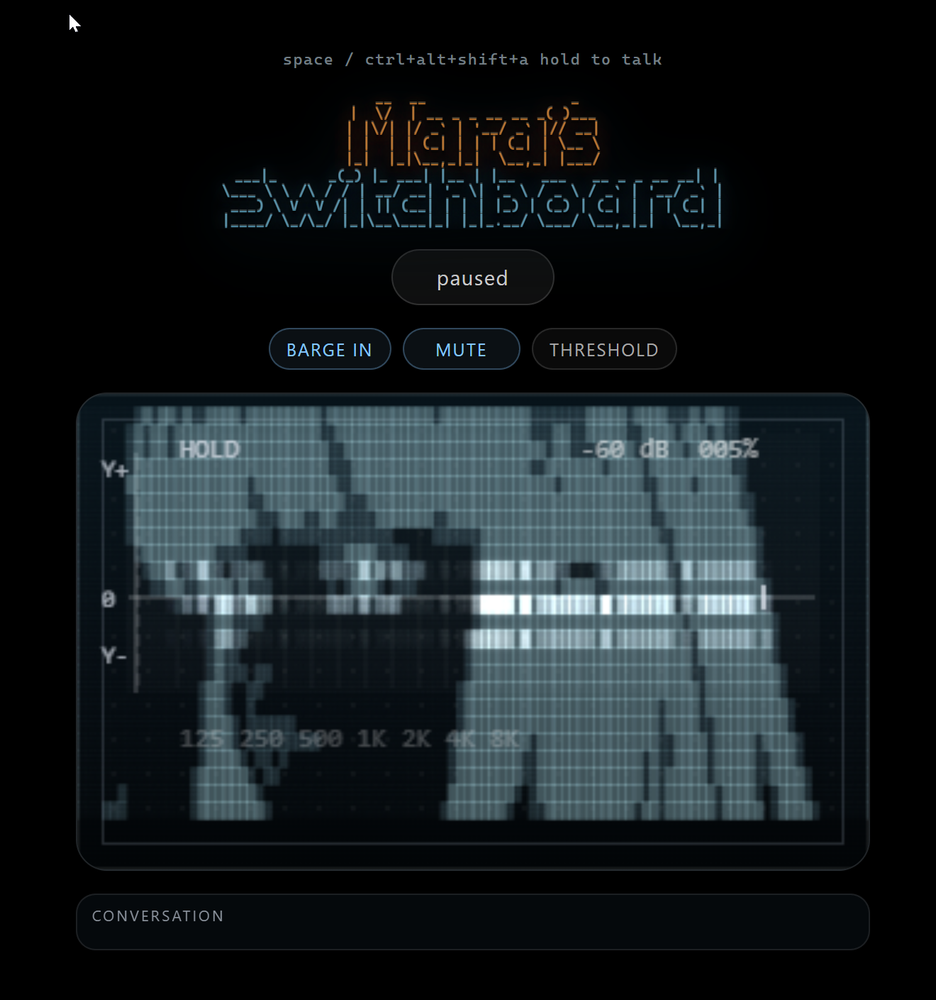

# Agent Switchboard



`agent-switchboard` is a local voice frontend for text agents. It gives you a browser setup page at `/setup`, a voice UI at `/voice`, local or remote Whisper-family STT, multiple TTS backends, and an optional Windows tray client.

This repo is still alpha. The main path works, but rough edges still exist.

## What This Repo Does

- records mic audio in the browser
- sends speech to the Python server for transcription
- sends the transcript to your configured conversation backend
- optionally speaks the reply with TTS
- can run in text-only mode with TTS disabled
- exposes a setup page so you can validate each step before launch

## Before You Start

You need all of these before the app can work:

- `git`
- Python `3.11+`
- one working conversation backend
- one working STT backend
- optionally one TTS backend

The currently tested path is:

- backend on Linux, macOS, or WSL
- browser UI at `http://127.0.0.1:8765`
- optional Windows tray client from `clients/windows`

Treat iOS, macOS Safari, and random remote mobile browser paths as unsupported unless you personally verify them.

## Fast Start

If you want the shortest route to a first working run, do this.

1. Clone the repo.

```bash
git clone <repo-url> agent-switchboard
cd agent-switchboard
```

2. Create and activate a virtual environment.

```bash
python3 -m venv .venv
source .venv/bin/activate
```

3. Install the app.

```bash
python -m pip install --upgrade pip
pip install -e .[dev]
```

4. Create your local env file.

```bash
cp .env.example .env
```

5. Edit `.env`.

At minimum, if you use the gateway backend, set:

```dotenv
AGENT_SWITCHBOARD_GATEWAY_TOKEN=replace-me
```

If you use ElevenLabs, also set:

```dotenv
AGENT_SWITCHBOARD_ELEVENLABS_API_KEY=replace-me
```

6. Start the server from the repo root.

```bash
source .venv/bin/activate
agent-switchboard
```

7. Open the setup page in a browser.

```text
http://127.0.0.1:8765/setup
```

8. In the setup page, do these steps in order:

- validate one STT backend
- validate one TTS backend, or choose `Disabled (text only)` for the simplest first run
- validate the conversation backend
- open the voice app

9. Open the voice UI.

```text
http://127.0.0.1:8765/voice
```

If setup is complete, `http://127.0.0.1:8765/` will also open the voice UI.

## Easiest First Run

If you only want to prove the pipeline works and do not care about spoken replies yet:

- set up STT
- choose `Disabled (text only)` in the TTS section
- validate the conversation backend
- open `/voice`

That removes TTS from the first-run debugging path.

## Important Runtime Rule

Run `agent-switchboard` from the repo root unless you also set:

- `AGENT_SWITCHBOARD_CONFIG_FILE`
- `AGENT_SWITCHBOARD_ENV_FILE`

By default, the server reads:

- `config.json`
- `.env`

from the current working directory.

## Optional Python Extras

You do not need every provider installed on day one.

Base install:

```bash
pip install -e .[dev]
```

Optional extras:

```bash
pip install -e .[dev,stt-faster-whisper,stt-whisper,tts-edge,tts-piper,tts-chatterbox]
```

Notes:

- the setup page can install some missing Python packages while validating providers
- Pocket TTS is currently installed on demand during validation
- NeuTTS is currently installed on demand during validation
- VibeVoice runs in its own separate environment and server

## TTS Backends

Currently supported:

- Edge TTS
- Piper
- Chatterbox
- Pocket TTS
- ElevenLabs
- NeuTTS
- VibeVoice Realtime
- `Disabled (text only)`

## NeuTTS Local Voices

If you use NeuTTS voice cloning, keep local reference material in `neutts-voices/`.

Example:

```text
neutts-voices/
  mara/
    reference.wav
    reference.txt
```

Rules:

- each voice gets its own subdirectory
- each subdirectory needs one `.wav` and one `.txt`
- the transcript should closely match the spoken audio
- these files are local workspace data, not something to commit

## Remote Access

Local browser URL:

```text
http://127.0.0.1:8765
```

Possible remote browser URL behind your own reverse proxy or Tailscale setup:

```text
https://<machine>.ts.net/voice/
```

Important:

- the browser URL and the conversation backend URL are not the same thing
- use your local gateway URL inside setup, not the public browser URL
- remote browser reachability does not mean every browser engine will work correctly

## Windows Client

The Windows tray client is optional.

This repo does not ship a prebuilt Windows release or checked-in bundle artifacts. Build it yourself from source.

Development run on Windows:

```powershell
cd C:\path\to\agent-switchboard\clients\windows
npm install
npm run tauri:dev
```

Build the Windows client:

```powershell
cd C:\path\to\agent-switchboard\clients\windows
npm install
npm run tauri:build
```

Prerequisites:

- WebView2
- Node.js `20+`
- Rust via `rustup`
- the Python backend already running on `http://127.0.0.1:8765`

For the full Windows-specific setup and autostart notes, read [clients/windows/README.md](clients/windows/README.md).

## Tests

Run the test suite from the repo root:

```bash
source .venv/bin/activate
PYTHONPATH=src python3 -m pytest
```

If you just want to verify a file or feature while editing, run a smaller slice, for example:

```bash
source .venv/bin/activate
PYTHONPATH=src python3 -m pytest tests/test_runtime.py
```

## Command Calibration

There is also a calibration helper for spoken control phrases.

Example:

```bash
source .venv/bin/activate
agent-switchboard-calibrate samples/hey-go --expected-action send --send-phrase "hey go"
```

Help:

```bash
source .venv/bin/activate
agent-switchboard-calibrate --help
```

## Speak Paragraphs via HTTP

The runtime exposes `POST /api/runtime/speak` on the same host/port as the web UI (default `http://127.0.0.1:8765`).
That endpoint waits for an active voice client, synthesizes the provided text, and pushes playback to the connected browser/app.

Raw curl example:

```bash
curl -sS http://127.0.0.1:8765/api/runtime/speak \
  -H 'Content-Type: application/json' \
  -d '{
    "text": "First paragraph.",
    "timeout_seconds": 15,
    "preset_name": "expressive",
    "speaker_name": "Speaker-B"
  }'
```

If you want to feed a longer reply and send each paragraph separately, use the helper:

```bash
source .venv/bin/activate
printf 'First paragraph.\n\nSecond paragraph.\n' | agent-switchboard-speak
```

It also accepts inline text or a file:

```bash
source .venv/bin/activate
agent-switchboard-speak --preset-name expressive --speaker-name Speaker-B \
  "First paragraph."

source .venv/bin/activate
agent-switchboard-speak --file reply.txt
```

Help:

```bash
source .venv/bin/activate
agent-switchboard-speak --help
```

## Troubleshooting

- If the app cannot find your config, you probably started it from the wrong directory.
- If the setup page says validation failed, fix that step before touching the next one.
- If you want the simplest debug path, disable TTS first.
- If the browser page loads but replies do not work, the conversation backend is usually misconfigured.
- If remote `.ts.net` access is flaky, validate everything locally on `127.0.0.1` first.
